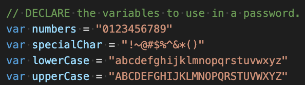
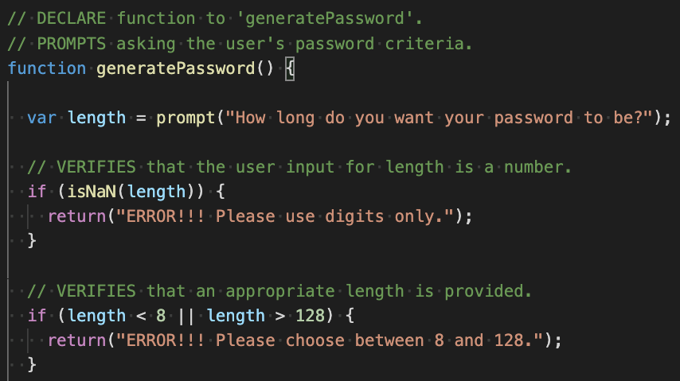
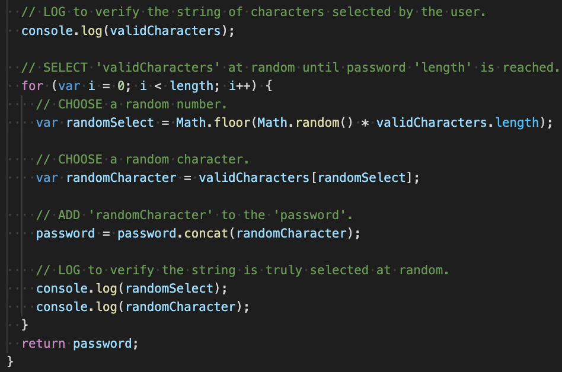

# Password-Generator

## UW CODING BOOT CAMP HOMEWORK 03

## Summary
In this homework, we have been provided a generic js code where we need to complete a function to generate random and secured passwords using variable criterias as chosen by the user.

## Links
1. [Github Repository](https://github.com/jkaganovsky/Password-Generator)
1. [Deployed Website](https://jkaganovsky.github.io/Password-Generator/)

## Content and Description:
1. Original js file

1. Added codes created on js file
* Here, I created the variables of characters I needed a user to have when generating their random password.

* When I inspected the site based only on the provided code, I noticed that the generatePassword syntax is not defined. This is where I started to create a function to define it.

* In order to have a password generated at the click of the generateBtn, a series of prompts are needed. I then needed to include these within the generatePassword function.

* As an added feature, I decided to include if statements so that error messages will appear when the user enters incorrect values and/or does not select any of the criterias prompted.

* After a selection criteria is selected by the user, I used if statements to record the appropriate variables/characters based on the user's responses.

* Once all of the above criteria have been met, this section is where I added a for loop in order to generate the user's requested password with their prompted length and selected validCharacters. And in order for that password to result as a random set of values at the appropriate length, each randomCharacter calculated value is added to the corresponding array within the string of the chosen variable.

## Credits
Majority of my code I mostly found useful when I went through w3schools.
1. For loop
https://www.w3schools.com/js/js_loop_for.asp
1. Math floor and Math random
https://www.w3schools.com/js/js_random.asp
1. Scope
https://www.w3schools.com/js/js_scope.asp
1. Conditions
https://www.w3schools.com/js/js_if_else.asp
1. Comparison
https://www.w3schools.com/js/js_comparisons.asp
1. Booleans
https://www.w3schools.com/js/js_booleans.asp
1. isNaN
https://developer.mozilla.org/en-US/docs/Web/JavaScript/Reference/Global_Objects/isNaN

## License
MIT License

Copyright (c) [2020] [Jailanie Kaganovsky]

Permission is hereby granted, free of charge, to any person obtaining a copy
of this software and associated documentation files (the "Software"), to deal
in the Software without restriction, including without limitation the rights
to use, copy, modify, merge, publish, distribute, sublicense, and/or sell
copies of the Software, and to permit persons to whom the Software is
furnished to do so, subject to the following conditions:

The above copyright notice and this permission notice shall be included in all
copies or substantial portions of the Software.

THE SOFTWARE IS PROVIDED "AS IS", WITHOUT WARRANTY OF ANY KIND, EXPRESS OR
IMPLIED, INCLUDING BUT NOT LIMITED TO THE WARRANTIES OF MERCHANTABILITY,
FITNESS FOR A PARTICULAR PURPOSE AND NONINFRINGEMENT. IN NO EVENT SHALL THE
AUTHORS OR COPYRIGHT HOLDERS BE LIABLE FOR ANY CLAIM, DAMAGES OR OTHER
LIABILITY, WHETHER IN AN ACTION OF CONTRACT, TORT OR OTHERWISE, ARISING FROM,
OUT OF OR IN CONNECTION WITH THE SOFTWARE OR THE USE OR OTHER DEALINGS IN THE
SOFTWARE.

